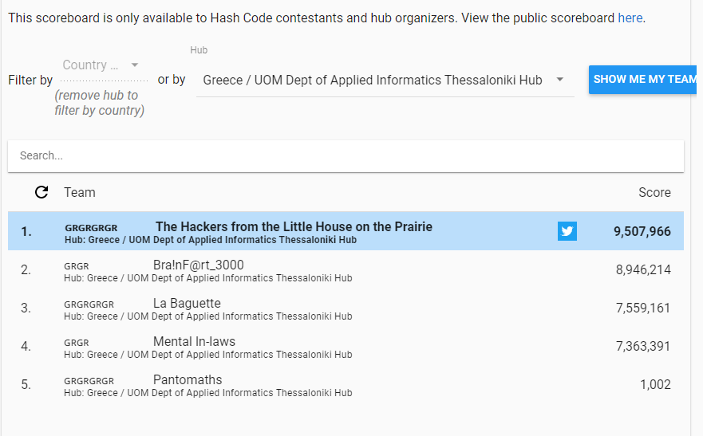
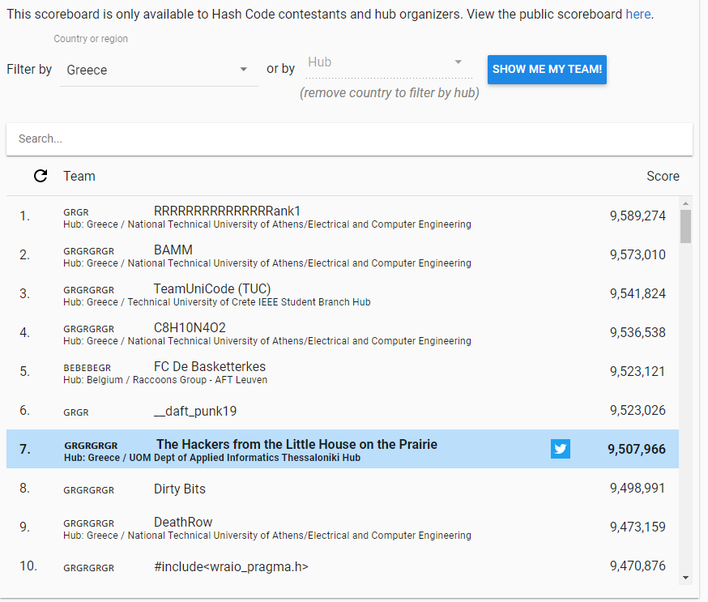

# The Hackers from the Little House in the Prairie - Google Hash Code 2021

This repository contains the source code of the Google Hash Code qualifying round submission of the The Hackers from the Little House in the Prairie team.

## About the team

The team was formed by four University of Macedonia Applied Informatics juniors from Thessaloniki:

* Apostolis Moschopoulos ([__@ApostolisMoschopoulos__](https://github.com/ApostolisMoschopoulos))
* Mitrofanos Ntatidis ([__@DatMitro__](https://github.com/DatMitro))
* Kostas Spiridopoulos ([__@KostasSpiridopoulos__](https://github.com/KostasSpiridopoulos))
* Theodore Tsirpanis ([__@teo-tsirpanis__](https://github.com/teo-tsirpanis))

We participated at the university's virtual hub.

## Technologies used

For the third time, we wrote the solution in [F#](https://fsharp.org), a functional-first programming language [designed for clean and correct code](http://fpbridge.co.uk).

## Score

The team's final score was __9,507,966 points__. Specifically, we placed:

* __1st__ out of 5 submissions in our hub.
* __7th__ out of 109 in Greece.
* __863rd__ out of 9004 in the world.

